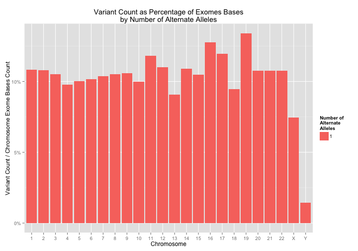

<!-- R Markdown Documentation, DO NOT EDIT THE PLAIN MARKDOWN VERSION OF THIS FILE -->

<!-- Copyright 2015 Google Inc. All rights reserved. -->

<!-- Licensed under the Apache License, Version 2.0 (the "License"); -->
<!-- you may not use this file except in compliance with the License. -->
<!-- You may obtain a copy of the License at -->

<!--     http://www.apache.org/licenses/LICENSE-2.0 -->

<!-- Unless required by applicable law or agreed to in writing, software -->
<!-- distributed under the License is distributed on an "AS IS" BASIS, -->
<!-- WITHOUT WARRANTIES OR CONDITIONS OF ANY KIND, either express or implied. -->
<!-- See the License for the specific language governing permissions and -->
<!-- limitations under the License. -->

# ExAC Variant Analysis

What follows is a brief exploration of the public data from [ExAC Release 0.2](ftp://ftp.broadinstitute.org/pub/ExAC_release/release0.2/README.release0.2).  

_Have feedback or corrections?  Please submit a pull request or file an issue!_


* [Multi-Allelic Variants by Chromosome](#multi-allelic-variants-by-chromosome)
 * [Normalized Multi-Allelic Variants by Chromosome](#normalized-multi-allelic-variants-by-chromosome)
* [Shared Variation](#shared-variation)
* [Shared Variation By Population](#shared-variation-by-population)
 * [All populations plotted together](#all-populations-plotted-together)
 * [Populations plotted individually](#populations-plotted-individually)
 * [Populations plotted individually overlaid by the variation among all](#populations-plotted-individually-overlaid-by-the-variation-among-all)
* [Burden of Variation](#burden-of-variation)
* [Provenance](#provenance)

## Multi-Allelic Variants by Chromosome

From [A Guide to the Exome Aggregation Consortium (ExAC) Data Set](http://macarthurlab.org/2014/11/18/a-guide-to-the-exome-aggregation-consortium-exac-data-set/) by the MacArthur Lab:

> There is increasing urgency for the development of tools that deal appropriately with these mult-iallelic sites - approximately ~7% of ExAC sites are now multi-allelic, and that fraction will grow as our sample size increases. That high rate of multiallelism shouldn't be surprising, by the way - the ExAC data set now (staggeringly) contains one variant every six bases on average, so it's not a shock to see many cases where variant locations overlap.


```r
result <- DisplayAndDispatchQuery("./sql/multi-allelic-variants.sql",
                                  project=project)
```

```
# Count ExAC variants grouped by both chromosome and number of alternate alleles.
SELECT
  reference_name,
  num_alternates,
  COUNT(num_alternates) AS num_multi_allelic_variants
FROM (
  SELECT
    reference_name,
    start,
    reference_bases,
    COUNT(alternate_bases) AS num_alternates
  FROM
    [google.com:biggene:ExAC_release_0_2.reshaped_variants]
  GROUP EACH BY
    reference_name,
    start,
    reference_bases
    )
GROUP BY
  reference_name,
  num_alternates
ORDER BY
  reference_name,
  num_alternates
```
Number of rows returned by this query: **144**.

Displaying the first few rows of the dataframe of results:
<!-- html table generated in R 3.2.2 by xtable 1.7-4 package -->
<!-- Fri Jan 22 10:27:36 2016 -->
<table border=1>
<tr> <th> reference_name </th> <th> num_alternates </th> <th> num_multi_allelic_variants </th>  </tr>
  <tr> <td> 1 </td> <td align="right">   1 </td> <td align="right"> 875970 </td> </tr>
  <tr> <td> 1 </td> <td align="right">   2 </td> <td align="right"> 69051 </td> </tr>
  <tr> <td> 1 </td> <td align="right">   3 </td> <td align="right"> 4587 </td> </tr>
  <tr> <td> 1 </td> <td align="right">   4 </td> <td align="right"> 582 </td> </tr>
  <tr> <td> 1 </td> <td align="right">   5 </td> <td align="right"> 244 </td> </tr>
  <tr> <td> 1 </td> <td align="right">   6 </td> <td align="right"> 431 </td> </tr>
   </table>


```r
result$reference_name <- factor(result$reference_name, levels=c(as.character(seq(1,22)), "X", "Y"))
result$num_alternates <- factor(result$num_alternates) 
```

Visualizing the results:

```r
ggplot(result, aes(x=reference_name, y=num_multi_allelic_variants,  fill=num_alternates)) +
  geom_bar(stat="identity") +
  xlab("Chromosome") +
  scale_y_log10(labels=comma) +
  scale_fill_discrete("Number of\nAlternate\nAlleles") +
  ylab("Number of Variants (log scale)") +
  ggtitle("Variant Count by Number of Alternate Alleles") +
  facet_grid(num_alternates ~ .)
```


### Normalized Multi-Allelic Variants by Chromosome

Let's normalize these results by [exon bases per chromosome](http://seqanswers.com/forums/showthread.php?t=5298) and take a closer look.


```r
basesPerChr <- read.csv("./data/bases-per-chromosome.csv")
result <- inner_join(result, basesPerChr)
```

```
## Joining by: "reference_name"
```

```
## Warning in inner_join_impl(x, y, by$x, by$y): joining factors with
## different levels, coercing to character vector
```

```r
result$reference_name <- factor(result$reference_name, levels=c(as.character(seq(1,22)), "X", "Y"))
```


```r
for(n in levels(result$num_alternates)) {
  p <- ggplot(filter(result, num_alternates == n),
              aes(x=reference_name,
                  y=num_multi_allelic_variants/Exon.Bases,
                  fill=num_alternates)) +
    geom_bar(stat="identity") +
    scale_fill_discrete("Number of\nAlternate\nAlleles") +
    xlab("Chromosome") +
    ylab("Variant Count / Chromosome Exome Bases Count") +
    scale_y_continuous(labels=percent_format()) +
    ggtitle("Variant Count as Percentage of Exomes Bases\nby Number of Alternate Alleles")
  print(p)
}
```



After normalizing the counts by the number of exon bases per chromosome, it is 
interesting to note that chromosome 14 appears to have a larger number of high 
multi-allelic sites compared to the other chromosomes.

## Shared Variation

Let explore shared variation in a manner similar to [what we did for 1,000 Genomes](https://github.com/googlegenomics/bigquery-examples/blob/master/1000genomes/README.md#exploring-shared-variation).

ExAC contains site information from 61,486 samples.  To paraphrase some helpful clarifications from [Daniel MacArthur](http://macarthurlab.org/people/): 

* The number of samples can vary by site, as there are some parts of the exome where (due to varying coverage) only a fraction of the samples were callable. 
* This number is indicated by the AN tag at each site in the VCF, which equates to the number of callable haplotypes (i.e. 2 x the number of callable individuals).
* Often AC_Adj (the allele count at a site, counting only high-confidence genotype calls) and AN_Adj (the total number of callable haplotypes at a site, counting only high-confidence genotypes) are used as a robust estimate of allele frequency at a given site.


```r
result <- DisplayAndDispatchQuery("./sql/shared-variant-counts.sql",
                                  project=project)
```

```
# Count the number of variants found in 0.00% of alleles (due to
# rounding), 0.01% of alleles, 0.02% of alleles, etc...
SELECT
  percentage_of_alleles_with_variant,
  COUNT(1) AS number_of_variants_shared_by_this_percentage_of_alleles
FROM (
  SELECT
    reference_name,
    start,
    end,
    reference_bases,
    alternate_bases,
    ROUND(AC_Adj/AN_Adj, 3) AS percentage_of_alleles_with_variant
    # AF could also have been used in place of AC_Adj/AN_Adj
  FROM
    [google.com:biggene:ExAC_release_0_2.reshaped_variants]
  WHERE reference_name NOT IN ("X", "Y")
  OMIT RECORD IF AN_Adj < 10000)
GROUP BY
  percentage_of_alleles_with_variant
ORDER BY
  percentage_of_alleles_with_variant
```
Number of rows returned by this query: **1001**.

Displaying the first few rows of the dataframe of results:
<!-- html table generated in R 3.2.2 by xtable 1.7-4 package -->
<!-- Fri Jan 22 10:27:44 2016 -->
<table border=1>
<tr> <th> percentage_of_alleles_with_variant </th> <th> number_of_variants_shared_by_this_percentage_of_alleles </th>  </tr>
  <tr> <td align="right"> 0.00 </td> <td align="right"> 9298591 </td> </tr>
  <tr> <td align="right"> 0.00 </td> <td align="right"> 208548 </td> </tr>
  <tr> <td align="right"> 0.00 </td> <td align="right"> 68097 </td> </tr>
  <tr> <td align="right"> 0.00 </td> <td align="right"> 37652 </td> </tr>
  <tr> <td align="right"> 0.00 </td> <td align="right"> 24518 </td> </tr>
  <tr> <td align="right"> 0.01 </td> <td align="right"> 17610 </td> </tr>
   </table>


```r
ggplot(result, aes(x=percentage_of_alleles_with_variant,
                   y=number_of_variants_shared_by_this_percentage_of_alleles)) +
  geom_point(alpha=1/3) +
  scale_x_continuous(labels=percent_format()) +
  scale_y_log10(labels=comma) +
  ylab("Count of variants shared by X% of the alleles (log scale)") +
  xlab("Percentage of alleles sharing a variant") +
  ggtitle("An overview of how variation is shared across alleles")
```


```r
# Get these results ready for later use
allResults <- mutate(result,
                     population="ALL",
                     description="All Populations"
                     )
```

## Shared Variation by Population

Let's drill down further by population.  Note that we pivot our data into a [tidy data format](http://vita.had.co.nz/papers/tidy-data.pdf) by taking advantage of the [CROSS JOIN](https://cloud.google.com/bigquery/query-reference#joins) feature of BigQuery.


```r
result <- DisplayAndDispatchQuery("./sql/shared-variant-counts-by-population.sql",
                                  project=project)
```

```
# Count the number of variants found in 0.00% of alleles (due to
# rounding), 0.01% of alleles, 0.02% of alleles, etc...
SELECT
  percentage_of_alleles_with_variant,
  COUNT(1) AS number_of_variants_shared_by_this_percentage_of_alleles,
  population,
  description
FROM (
  SELECT
    reference_name,
    start,
    end,
    reference_bases,
    alternate_bases,
    population,
    description,
    CASE
      WHEN population = 'AFR' THEN ROUND(AC_AFR/AN_AFR, 3)
      WHEN population = 'AMR' THEN ROUND(AC_AMR/AN_AMR, 3)
      WHEN population = 'EAS' THEN ROUND(AC_EAS/AN_EAS, 3)
      WHEN population = 'FIN' THEN ROUND(AC_FIN/AN_FIN, 3)
      WHEN population = 'NFE' THEN ROUND(AC_NFE/AN_NFE, 3)
      WHEN population = 'OTH' THEN ROUND(AC_OTH/AN_OTH, 3)
      WHEN population = 'SAS' THEN ROUND(AC_SAS/AN_SAS, 3)
      END AS percentage_of_alleles_with_variant
  FROM
    [google.com:biggene:ExAC_release_0_2.reshaped_variants] AS variants
  CROSS JOIN
    [google.com:biggene:ExAC_release_0_2.populations] AS populations
  WHERE reference_name NOT IN ("X", "Y")
  OMIT RECORD IF AN_Adj < 10000
  HAVING percentage_of_alleles_with_variant IS NOT NULL)
GROUP BY
  percentage_of_alleles_with_variant,
  population,
  description
ORDER BY
  percentage_of_alleles_with_variant,
  population,
  description
```
Number of rows returned by this query: **7007**.

Displaying the first few rows of the dataframe of results:
<!-- html table generated in R 3.2.2 by xtable 1.7-4 package -->
<!-- Fri Jan 22 10:27:49 2016 -->
<table border=1>
<tr> <th> percentage_of_alleles_with_variant </th> <th> number_of_variants_shared_by_this_percentage_of_alleles </th> <th> population </th> <th> description </th>  </tr>
  <tr> <td align="right"> 0.00 </td> <td align="right"> 9188210 </td> <td> AFR </td> <td> African &amp; African American </td> </tr>
  <tr> <td align="right"> 0.00 </td> <td align="right"> 9359900 </td> <td> AMR </td> <td> American </td> </tr>
  <tr> <td align="right"> 0.00 </td> <td align="right"> 9448338 </td> <td> EAS </td> <td> East Asian </td> </tr>
  <tr> <td align="right"> 0.00 </td> <td align="right"> 9507579 </td> <td> FIN </td> <td> Finnish </td> </tr>
  <tr> <td align="right"> 0.00 </td> <td align="right"> 9479449 </td> <td> NFE </td> <td> Non-Finnish European </td> </tr>
  <tr> <td align="right"> 0.00 </td> <td align="right"> 9280346 </td> <td> OTH </td> <td> Other </td> </tr>
   </table>

### All populations plotted together

```r
ggplot(result, aes(x=percentage_of_alleles_with_variant,
                   y=number_of_variants_shared_by_this_percentage_of_alleles,
                   color=population)) +
  geom_point(alpha=1/3) +
  scale_x_continuous(labels=percent_format()) +
  scale_y_log10(labels=comma) +
  ylab("Count of variants shared by X% of the alleles (log scale)") +
  xlab("Percentage of alleles sharing a variant") +
  ggtitle("An overview of how variation is shared across alleles")
```


### Populations plotted individually

```r
for(pop in unique(result$population)) {
  p <- ggplot(filter(result, population == pop),
              aes(x=percentage_of_alleles_with_variant,
                   y=number_of_variants_shared_by_this_percentage_of_alleles,
                   color=population)) +
  geom_point(alpha=1/3) +
  scale_x_continuous(labels=percent_format()) +
  scale_y_log10(labels=comma) +
  ylab("Count of variants shared by X% of the alleles (log scale)") +
  xlab("Percentage of alleles sharing a variant") +
  ggtitle("An overview of how variation is shared across alleles")
  print(p)
}
```


### Populations plotted individually overlaid by the variation among all

```r
for(pop in unique(result$population)) {
  popVsAll <- rbind(allResults, filter(result, population == pop))
  popVsAll$population <- factor(popVsAll$population, levels=c("ALL", pop))
  p <- ggplot(popVsAll,
              aes(x=percentage_of_alleles_with_variant,
                   y=number_of_variants_shared_by_this_percentage_of_alleles,
                   color=population)) +
  geom_point(alpha=1/3) +
  scale_x_continuous(labels=percent_format()) +
  scale_y_log10(labels=comma) +
  ylab("Count of variants shared by X% of the alleles (log scale)") +
  xlab("Percentage of alleles sharing a variant") +
  ggtitle("An overview of how variation is shared across alleles")
  print(p)
}
```


# Burden of Variation

What follows is a sample query upon individual-level data from 1,000 Genomes phase 1 variants and SNP annotations from Tute Genomics.  Note that the [1,000 Genomes table](https://bigquery.cloud.google.com/table/genomics-public-data:1000_genomes.variants) has 39,728,277 rows and the [Tute Annotations table](https://bigquery.cloud.google.com/table/silver-wall-555:TuteTable.hg19) has 8,582,972,385 rows.

We calculate the null spectrum (burden of variation) for each gene: how many individuals have 2 or more missense mutations at < 2% frequency in gene ____?


```r
result <- DisplayAndDispatchQuery("./sql/burden-of-variation.sql",
                                  project=project)
```

```
# Calculate the null spectrum (burden of variation) for each gene: How many 
# individuals have 2 or more missense mutations at < 2% frequency for each gene? 
SELECT
  Gene,
  ExonicFunc,
  call.call_set_name,
  COUNT(call.call_set_name) AS number_of_rare_missense_variants
FROM
  [silver-wall-555:TuteTable.hg19] AS annots
JOIN
  EACH
  (
  SELECT
    reference_name,
    start,
    reference_bases,
    # 1,000 Genomes phase 1 variants are bi-allelic
    NTH(1, alternate_bases) WITHIN RECORD AS alternate_bases,
    call.call_set_name,
  FROM
    [genomics-public-data:1000_genomes.variants]
  WHERE
    AF <= 0.02
  OMIT
    call IF EVERY(call.genotype != 1)
    ) AS vars
ON
  vars.reference_name = annots.Chr
  AND vars.start = annots.Start
  AND vars.reference_bases = annots.Ref
  AND vars.alternate_bases = annots.Alt
WHERE
  ExonicFunc = "missense"
GROUP EACH BY
  Gene,
  ExonicFunc,
  call.call_set_name,
HAVING
  number_of_rare_missense_variants > 1
ORDER BY
  Gene,
  ExonicFunc,
  call.call_set_name

Retrieving data:  2.6s
Retrieving data:  3.7s
Retrieving data:  4.9s
Retrieving data:  6.1s
Retrieving data:  7.6s
Retrieving data:  9.1s
Retrieving data: 10.2s
Retrieving data: 11.4s
Retrieving data: 13.7s
```
Number of rows returned by this query: **91995**.

Displaying the first few rows of the dataframe of results:
<!-- html table generated in R 3.2.2 by xtable 1.7-4 package -->
<!-- Fri Jan 22 10:28:14 2016 -->
<table border=1>
<tr> <th> Gene </th> <th> ExonicFunc </th> <th> call_call_set_name </th> <th> number_of_rare_missense_variants </th>  </tr>
  <tr> <td> A1BG </td> <td> missense </td> <td> NA19149 </td> <td align="right">   2 </td> </tr>
  <tr> <td> A1BG </td> <td> missense </td> <td> NA19248 </td> <td align="right">   2 </td> </tr>
  <tr> <td> A2M </td> <td> missense </td> <td> NA18981 </td> <td align="right">   2 </td> </tr>
  <tr> <td> A2M </td> <td> missense </td> <td> NA19247 </td> <td align="right">   2 </td> </tr>
  <tr> <td> A2M </td> <td> missense </td> <td> NA19334 </td> <td align="right">   2 </td> </tr>
  <tr> <td> A2M </td> <td> missense </td> <td> NA19452 </td> <td align="right">   2 </td> </tr>
   </table>

Let's take a look at the burden of variation within BRCA1:

```r
brca1Result <- filter(result, grepl("BRCA1", Gene))
```

<!-- html table generated in R 3.2.2 by xtable 1.7-4 package -->
<!-- Fri Jan 22 10:28:14 2016 -->
<table border=1>
<tr> <th> Gene </th> <th> ExonicFunc </th> <th> call_call_set_name </th> <th> number_of_rare_missense_variants </th>  </tr>
  <tr> <td> BRCA1 </td> <td> missense </td> <td> HG00329 </td> <td align="right">   3 </td> </tr>
  <tr> <td> BRCA1 </td> <td> missense </td> <td> HG00637 </td> <td align="right">   2 </td> </tr>
  <tr> <td> BRCA1 </td> <td> missense </td> <td> HG00737 </td> <td align="right">   2 </td> </tr>
  <tr> <td> BRCA1 </td> <td> missense </td> <td> HG01102 </td> <td align="right">   2 </td> </tr>
  <tr> <td> BRCA1 </td> <td> missense </td> <td> NA12874 </td> <td align="right">   2 </td> </tr>
  <tr> <td> BRCA1 </td> <td> missense </td> <td> NA18504 </td> <td align="right">   2 </td> </tr>
  <tr> <td> BRCA1 </td> <td> missense </td> <td> NA18950 </td> <td align="right">   2 </td> </tr>
  <tr> <td> BRCA1 </td> <td> missense </td> <td> NA19028 </td> <td align="right">   2 </td> </tr>
  <tr> <td> BRCA1 </td> <td> missense </td> <td> NA19044 </td> <td align="right">   2 </td> </tr>
  <tr> <td> BRCA1 </td> <td> missense </td> <td> NA19172 </td> <td align="right">   2 </td> </tr>
  <tr> <td> BRCA1 </td> <td> missense </td> <td> NA19328 </td> <td align="right">   2 </td> </tr>
  <tr> <td> BRCA1 </td> <td> missense </td> <td> NA19443 </td> <td align="right">   2 </td> </tr>
  <tr> <td> BRCA1 </td> <td> missense </td> <td> NA19448 </td> <td align="right">   2 </td> </tr>
  <tr> <td> BRCA1 </td> <td> missense </td> <td> NA19469 </td> <td align="right">   2 </td> </tr>
  <tr> <td> BRCA1 </td> <td> missense </td> <td> NA19712 </td> <td align="right">   2 </td> </tr>
  <tr> <td> BRCA1 </td> <td> missense </td> <td> NA19780 </td> <td align="right">   2 </td> </tr>
  <tr> <td> BRCA1 </td> <td> missense </td> <td> NA19819 </td> <td align="right">   3 </td> </tr>
  <tr> <td> BRCA1 </td> <td> missense </td> <td> NA20294 </td> <td align="right">   2 </td> </tr>
  <tr> <td> BRCA1 </td> <td> missense </td> <td> NA20412 </td> <td align="right">   2 </td> </tr>
  <tr> <td> BRCA1 </td> <td> missense </td> <td> NA20506 </td> <td align="right">   2 </td> </tr>
  <tr> <td> BRCA1 </td> <td> missense </td> <td> NA20756 </td> <td align="right">   2 </td> </tr>
   </table>

And let's also see which individuals carry the most burden of variation:

```r
sampleResult <- arrange(summarize(group_by(result, call_call_set_name), total = sum(number_of_rare_missense_variants)), desc(total))
```

<!-- html table generated in R 3.2.2 by xtable 1.7-4 package -->
<!-- Fri Jan 22 10:28:14 2016 -->
<table border=1>
<tr> <th> call_call_set_name </th> <th> total </th>  </tr>
  <tr> <td> NA19317 </td> <td align="right"> 743 </td> </tr>
  <tr> <td> NA19331 </td> <td align="right"> 738 </td> </tr>
  <tr> <td> NA19399 </td> <td align="right"> 725 </td> </tr>
  <tr> <td> NA19313 </td> <td align="right"> 709 </td> </tr>
  <tr> <td> NA19377 </td> <td align="right"> 702 </td> </tr>
  <tr> <td> NA18868 </td> <td align="right"> 701 </td> </tr>
   </table>

# Provenance

* The source data from ftp://ftp.broadinstitute.org/pub/ExAC_release/release0.2/ExAC.r0.2.sites.vep.vcf.gz was loaded into Google Genomics and exported to BigQuery as table [google.com:biggene:ExAC_release_0_2.variants](https://bigquery.cloud.google.com/table/google.com:biggene:ExAC_release_0_2.variants).  
* We then flattened the resulting table to make it a bit easier to query by materializing the result of query [reshape-data.sql](./sql/reshape-data.sql) to table [google.com:biggene:ExAC_release_0_2.reshaped_variants](https://bigquery.cloud.google.com/table/google.com:biggene:ExAC_release_0_2.reshaped_variants).
  * Note that the upcoming User-Defined Function feature for BigQuery will make this sort of transformation easier to write.  See [reshape-data-udf.sql](./sql/reshape-data-udf.sql) as an example.


```r
sessionInfo()
```

```
## R version 3.2.2 (2015-08-14)
## Platform: x86_64-apple-darwin13.4.0 (64-bit)
## Running under: OS X 10.10.5 (Yosemite)
## 
## locale:
## [1] en_US.UTF-8/en_US.UTF-8/en_US.UTF-8/C/en_US.UTF-8/en_US.UTF-8
## 
## attached base packages:
## [1] stats     graphics  grDevices utils     datasets  methods   base     
## 
## other attached packages:
##  [1] mgcv_1.8-7      nlme_3.1-121    ggplot2_1.0.1   bigrquery_0.1.0
##  [5] scales_0.3.0    dplyr_0.4.3     RCurl_1.95-4.6  bitops_1.0-6   
##  [9] xtable_1.7-4    knitr_1.10.5   
## 
## loaded via a namespace (and not attached):
##  [1] Rcpp_0.12.0      rstudioapi_0.3.1 magrittr_1.5     MASS_7.3-43     
##  [5] munsell_0.4.2    lattice_0.20-33  colorspace_1.2-6 R6_2.1.1        
##  [9] highr_0.5        stringr_1.0.0    httr_1.0.0       plyr_1.8.3      
## [13] tools_3.2.2      parallel_3.2.2   grid_3.2.2       gtable_0.1.2    
## [17] DBI_0.3.1        htmltools_0.2.6  lazyeval_0.1.10  assertthat_0.1  
## [21] digest_0.6.8     Matrix_1.2-2     reshape2_1.4.1   formatR_1.2     
## [25] curl_0.9.3       evaluate_0.7.2   rmarkdown_0.7    labeling_0.3    
## [29] stringi_0.5-5    jsonlite_0.9.17  proto_0.3-10
```
